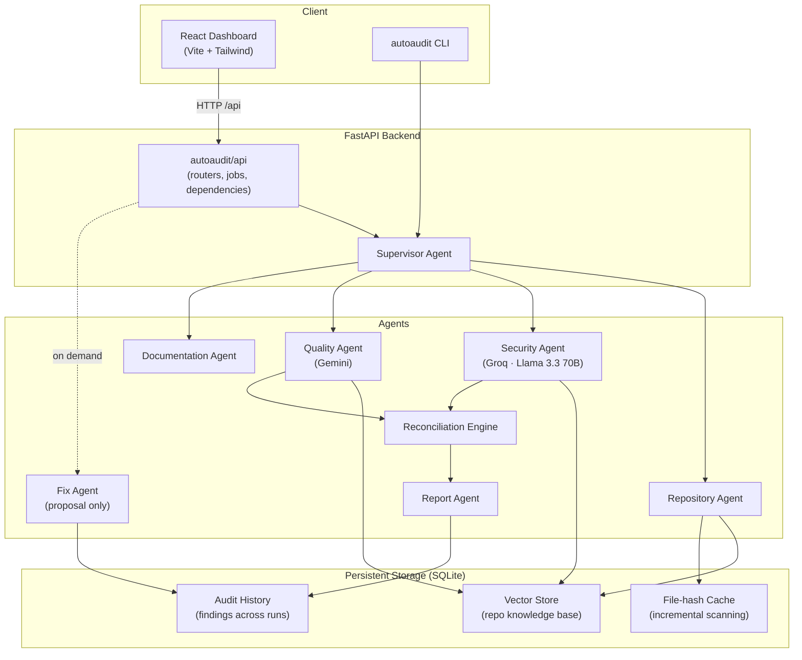
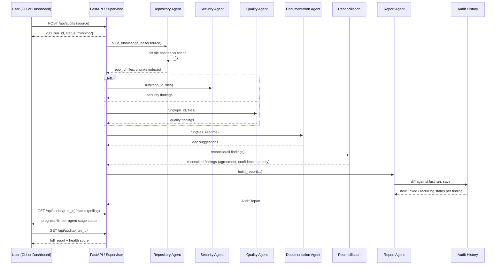
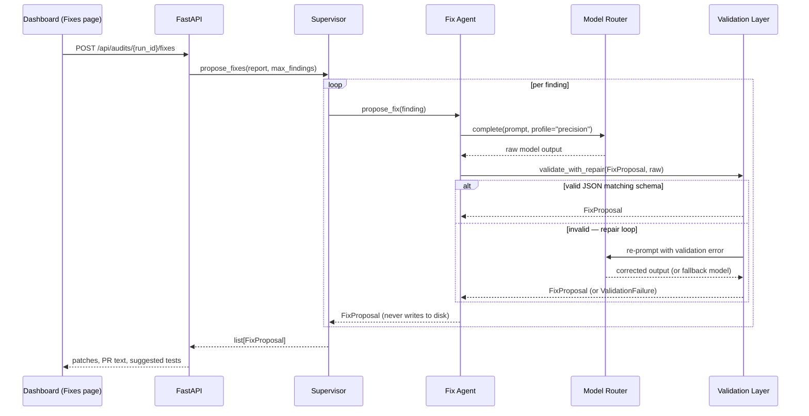

# Architecture

## System overview



## Audit run sequence



## Fix proposal flow (never auto-applied)



## Why two LLM providers, routed by task

| Task profile | Provider | Rationale |
|---|---|---|
| `precision` (Security Agent, Fix Agent) | Groq — Llama 3.3 70B | Careful, conservative reasoning on security-sensitive evidence is worth the latency/cost. |
| `cheap` / `bulk` (Quality Agent, Documentation Agent) | Gemini | Higher-volume, lower-stakes reasoning across many files/functions — a faster/cheaper model is the right trade-off. |

Both share one `LLMClient` interface (`autoaudit/llm/base.py`), both have a
deterministic mock mode (zero network, zero cost, fully offline-testable),
and `ModelRouter` (`autoaudit/llm/router.py`) automatically falls back to
the other provider on error or timeout.

### Handling provider failure

Two failure modes look similar and need opposite responses. `ProviderUnavailable`
(`llm/base.py`) records which one occurred in its `kind`:

| | `kind="quota"` (HTTP 429) | `kind="capacity"` (HTTP 5xx / 503) |
|---|---|---|
| Whose limit | Ours — our key, our request rate | The provider's — the model is saturated for everyone |
| Batching / spacing helps? | **Yes** — this is what `GEMINI_REQUEST_DELAY_MS` and the agents' batched drafting exist for | **No** — asking more slowly changes nothing |
| Real remedy | Fewer/larger requests, higher quota tier | Another provider, or wait |

Conflating the two is easy and costly: batching was originally introduced
to fix 429s and did, but a 503 ("this model is currently experiencing high
demand") then still killed runs, because no amount of self-throttling
addresses someone else's capacity.

The resulting layering, from innermost outwards:

1. **Client** — spaces requests (`GEMINI_REQUEST_DELAY_MS`), retries
   429/5xx with exponential backoff honouring `Retry-After`, and raises
   `ProviderUnavailable` once its budget is spent. 4xx fails fast: a bad
   key or malformed request is not fixed by asking again.
2. **Router** — since the client only raises after exhausting its own
   backoff, the router does **not** retry that provider; it fails over
   immediately. A **circuit breaker**
   (`RouterConfig.unavailable_cooldown_seconds`, 45s) then skips that
   provider for a cooldown window, so the *next* call doesn't pay another
   full backoff cycle to rediscover the outage. On a 100-file repo this is
   the difference between a ~150s degraded run and a ~10s one.
3. **Agents** — Security, Quality and Documentation all draft through the
   router and **degrade instead of raising**. Detection is deterministic
   (Semgrep, heuristics, vector similarity); only the human-readable
   description needs a model. A finding whose description can't be
   generated keeps its file, line, rule, severity and evidence and carries
   its raw heuristic/static-analysis message instead.
4. **Report** — `AuditReport.degraded_suggestions` counts how many items
   this affected, and the Dashboard shows a banner, so a placeholder is
   never mistaken for model output.

The rule this encodes: **never lose a deterministic result because a
probabilistic one failed.** An audit that completes with terser prose is
far more useful than one that throws away its repository index, security
scan and quality analysis at the final step.

### Pipeline phases: detect, then draft

Every analysis agent splits into two halves, and the split is what keeps
the run fast:

- **`detect()`** — deterministic and offline: Semgrep / the fallback
  scanner, long-function and duplicate heuristics, docstring gap detection,
  vector-similarity retrieval. No model calls, so all three agents run
  concurrently.
- **`draft()`** — the model-bound half that turns each detected item into
  prose. Run sequentially afterwards so the two Gemini-backed agents don't
  burst the same key at once (the original reason for the split).

Security was the last agent to get this treatment, and it was the most
expensive omission. Its model calls sat inside the *parallel* phase, so
Quality and Documentation finished detecting in seconds and then blocked on
it — the live pipeline view showed Security spinning for minutes with
everything queued behind it. It also issued **one request per finding**,
which matters far more here than elsewhere: the offline fallback scanner
finds a handful of issues in Flask, but `semgrep --config=auto` finds
hundreds, and each was a separate sequential round trip.

Batching all three agents means requests scale with `ceil(N / batch_size)`
rather than `N`:

| Findings | Unbatched | Batched (size 8) | Speedup |
|---|---|---|---|
| 10 | 12s | 2.4s | 5.0× |
| 50 | 60s | 8.4s | 7.1× |
| 200 | 240s | 30.1s | 8.0× |
| 500 | 600s | 75.7s | 7.9× |

(measured at 1.2s per request). Batch sizes are configurable per agent via
`SECURITY_AGENT_BATCH_SIZE`, `QUALITY_AGENT_BATCH_SIZE` and
`DOCUMENTATION_AGENT_BATCH_SIZE`.

The batch protocol (`llm/batching.py`) uses explicit `###ITEM n###` markers
and refuses to guess: if the model returns the wrong number of sections,
`split_batch_response` returns `None` and the caller retries that batch one
item at a time rather than misattributing text between findings.

Batches are capped by **total prompt size** as well as item count
(`chunk_items`). Item count alone is a poor proxy: a Quality summary is one
line, but a Documentation prompt embeds the symbol's source, so eight of
those can run to tens of thousands of characters. Oversized prompts are slow
to generate against and likelier to hit the output ceiling before all
sections are written — which triggers the per-item fallback and costs more
requests than batching saved.

### Gemini request configuration

The Gemini payload carries an explicit `generationConfig`. Sending none —
which is what the client originally did — has three consequences that only
show up under load:

- **`maxOutputTokens`.** Bounds generation, and makes truncation detectable.
- **Thinking controls, which differ by model generation** (below).
- **`temperature`, on 2.x only** — matching the Groq client's 0.2.

#### Model generations are not interchangeable

`GeminiClient` picks its `generationConfig` from the configured model name
(`_is_gemini_3_or_newer`, a major-version prefix check rather than a
hardcoded list, since models ship faster than this file changes):

| | Gemini 2.x | Gemini 3.x |
|---|---|---|
| Thinking control | `thinkingConfig.thinkingBudget` (integer) | `thinking.thinkingLevel` (`minimal`/`low`/`medium`/`high`) |
| Default | 2.5 Flash thinks by default; `0` disables | per-model — `gemini-3.5-flash-lite` already defaults to `minimal` |
| `temperature` / `topP` / `topK` | supported | **deprecated** — ignored now, documented to return 400 in later generations |

Two things make this worth encoding rather than sending one payload to
everything: sending *both* thinking fields in one request is a documented
400, and the 3.x sampling parameters are on a deprecation path that will
start failing requests rather than being quietly ignored.

A model that rejects the thinking field for any reason is detected once and
the field is dropped for the rest of the session. That's safe because every
model has a sane default — for Flash-Lite it is exactly the `minimal` we'd
have asked for.

#### Per-request timing

Each agent times and traces every model call
(`draft.request` / `explain.request`) with its duration, item count and
prompt size. Stage-level durations alone can't distinguish "many findings",
"one slow request", "rate-limited retries" and "batch didn't parse, fell
back to per-item" — all of which look identical from outside. These events
appear live in the Audit page's streaming logs.

Response handling treats an empty or truncated candidate as a *failure*,
not as an empty answer. The previous code returned `""` for a response with
no parts — exactly what a thinking-enabled model produces when the output
budget is consumed before it writes anything — and that empty string flowed
silently into a finding's description.

### Latency budgets: background vs interactive

Model calls happen in two very different contexts, and one timeout cannot
serve both:

| | Background (audit drafting) | Interactive (Fixes, AI Comparison) |
|---|---|---|
| Config | `timeout_seconds` (240s) | `interactive_timeout_seconds` (45s) |
| Scope | per attempt | the **whole** routed call, via a deadline |
| Why | batched drafting legitimately runs for minutes; a short budget kills calls still making progress | a person is watching a spinner; anything past ~a minute is indistinguishable from a hang |

Interactive callers pass `interactive=True`, which converts the budget into
an absolute deadline covering every retry *and* every failover. Applying it
per attempt instead left 3 retries × 2 providers reaching several minutes —
and retrying a provider that just failed to answer within budget mostly
reproduces the same wait.

`FixAgent.propose_fixes` additionally shares one wall-clock deadline
(`DEFAULT_BATCH_BUDGET_SECONDS`, 90s) across the whole batch, drafts up to
`DEFAULT_MAX_WORKERS` findings concurrently, and always returns one
proposal per requested finding — anything not drafted in time comes back as
a labelled deterministic proposal, so the caller never has to tell "no fix
available" apart from "didn't finish".

Two implementation details that are easy to get wrong:

- **`ThreadPoolExecutor` as a context manager defeats the timeout.**
  `__exit__` calls `shutdown(wait=True)`, so the abandoned call still runs
  to completion and the caller waits the full duration before receiving its
  `TimeoutError`. `_call_with_timeout` shuts the pool down with
  `wait=False` instead.
- **The client-side ceiling must lose the race.** `frontend/src/lib/api.ts`
  aborts requests via `AbortController` (`fetch` has no timeout of its
  own), but its ceiling sits above the server's so the user sees the
  server's specific diagnosis rather than a generic client timeout.

## Data model

- **Finding** — the atomic unit produced by Security/Quality agents: file,
  line, category, rule, severity, description, evidence, a stable
  `fingerprint` (file + line + category + rule) used for cross-run diffing.
- **ReconciledFinding** — a *view* over one or more Findings that land on
  the same code, with agreement/confidence/priority computed by
  `ReconciliationEngine`. Not persisted separately — recomputed per report.
- **FixProposal** — Fix Agent output; never written to disk automatically.
- **DocSuggestion** — Documentation Agent output.
- **AuditReport** — the full result of one run: findings +
  doc_suggestions + reconciled_findings + test-coverage signal + metadata.
  Persisted to `audit_history.db` as findings plus the run's health score,
  `files_scanned` and `chunks_indexed`; the full object (including
  doc/reconciled data) lives in the API's in-memory `JobStore` for the life
  of the process.
- **RepoHealthScore** — see below.
- **TestCoverageDetail** — the observable test signals behind the score.

## Repository Health Score

Implemented in `autoaudit/analysis/health_score.py`. Every category converts
its findings into a **weighted penalty per scanned file**, then maps that
density onto 0-100 with a hyperbolic curve:

```
score = 100 / (1 + density / D)
```

where `density == D` scores exactly 50 and the curve approaches 0
asymptotically rather than clamping there.

| Category | Penalty source | `D` (50-point density) | Composite weight |
|---|---|---|---|
| Security | severity-weighted security findings | 0.5 | 30% |
| Quality | severity-weighted quality findings | 1.5 | 20% |
| Documentation | share of files with a doc gap | — (linear) | 15% |
| Architecture | long functions (×1) + duplicate blocks (×1.5) | 0.8 | 15% |
| Technical debt | architecture penalties + doc-affected files (×0.5) | 1.2 | 10% |
| Test coverage | measured signal (below) | — | 10% |

Severity weights: high 10, medium 4, low 1, info 0.25.

Two rules matter for correctness:

1. **Findings with status `fixed` are excluded from every category.** Those
   are history entries reconstructed by `diff_against_last` for issues that
   are no longer in the code. Counting them penalised a repository for work
   it had already done and could make the score fall after a real fix.
2. **Density, not raw count.** An earlier implementation subtracted a flat
   penalty per finding from 100. That made the score a function of
   repository size: anything past a couple hundred files pinned quality,
   architecture and technical debt at 0 simultaneously, so the composite
   carried no information and could not respond to the repo improving.

### Test coverage signal

`autoaudit/analysis/test_coverage.py`. AutoAudit deliberately does **not**
execute an untrusted repository's test suite, so this is not line coverage.
It measures two things directly observable from source:

- **Module coverage (60%)** — share of source modules with a matching test
  file (`test_<name>.py`, `<name>_test.py`, `<name>.test.ts`, …) or
  referenced by name from the test suite.
- **Test density (40%)** — test cases per source symbol, saturating at one
  test per two symbols.

When a repository has no source files to judge, the signal reports
`measured=False`; the health score then drops the category and renormalises
the remaining weights instead of scoring it 0. This replaced a hardcoded
constant of `70` that was identical for an exhaustively tested repo and one
with no tests at all, while still carrying 10% of the composite.
